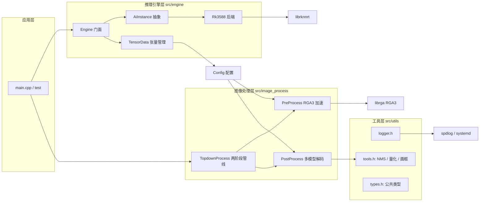

# ai_framework

基于 **RK3588（Rockchip NPU）** 的边缘 AI 推理框架，使用 C++14 编写。提供多后端推理引擎抽象、RGA 硬件加速图像预处理、多模型后处理（目标检测 / 姿态估计 / 实例分割）以及两阶段 **top-down 姿态估计**完整管线。

当前已在 `RK3588 + RKNN + librga` 平台上落地运行，并支持通过 `TensorRT` / `ONNX Runtime` 扩展其他后端（代码中已预留接口）。

---

## ✨ 特性

- **多后端推理引擎抽象**
  - `Engine` 门面 + `AiInstance` 后端抽象 + 工厂 `CreateBackend()`
  - 已实现 **RKNN** 后端（`RK3588`），预留 `TRT` / `ONNX` 宏开关
- **RKNN zero-copy 推理**
  - `rknn_create_mem` + `rknn_set_io_mem` 零拷贝读写
  - 查询原生输出属性 `RKNN_QUERY_NATIVE_OUTPUT_ATTR`，支持 **NC1HWC2（16 字节 channel-tile）** 原生布局，并内置 NC1HWC2 → NCHW 转换
- **RGA 硬件加速预处理**
  - 使用 **RGA3** 一次性完成 `resize + BGR→RGB + letterbox（左上角对齐，背景填充 114）`
  - 通过 `importbuffer_virtualaddr` + `wrapbuffer_handle` + `improcess` 实现，降低 CPU 占用
- **多模型后处理**
  - `RTMDet`（anchor-free、无 DFL）、`YOLOv8 / v10 / v11 / v13`、`RTMPose`（simcc 解码）、实例分割
  - 自适应根据引擎 `Config` 读取输出布局与量化参数，非硬编码
- **Top-down 两阶段姿态估计管线**
  - 检测框外扩 → RGA 仿射变换裁剪 → 关键点解码 → 坐标映射回原图
  - 支持手部 21 点（变长关键点，非固定数组）
- **量化与数值工具**
  - INT8 affine 反量化（区分 `uint8` / `int8`）、`FP16→FP32`、DFL、NMS、sigmoid 模板
- **日志系统**
  - 基于 `spdlog` / `fmt`，支持标准输出与 **systemd journal**（`SPDLOG_LEVEL` / `SPDLOG_STDOUT` / `SPDLOG_SYSTEMD` 环境变量控制）
- **工程化**
  - CTest 单元测试、CPack 打包（生成 `.tar.Z` / `.sh` 安装包）

---

## 📁 目录结构

```
ai_framework/
├── CMakeLists.txt               # 顶层 CMake 配置（OpenCV、CTest、CPack、第三方库路径）
├── README.md
├── bin/                         # 编译输出（可执行文件）
├── build/                       # CMake 构建目录（Makefile + 产物 + CPack 打包结果）
├── config/                      # 配置文件目录（预留）
├── model/                       # RKNN 模型
│   ├── rtmdet_nano_320x320_static_fp16.rknn
│   ├── rtmdet_nano_320x320_static_int8.rknn
│   ├── rtmpose-m_8xb256_hand_finetune-fp16.rknn      # 手部关键点（FP16）
│   └── rtmpose-m_8xb256_hand-fintune-256x256-int8_pow.rknn
├── source/                      # 测试图片与结果输出
├── src/                         # 核心源码
│   ├── CMakeLists.txt
│   ├── main.cpp                 # 主程序（top-down 两阶段姿态估计演示）
│   ├── engine/                  # 推理引擎抽象层
│   │   ├── ai_framework.h/.cpp  # AiInstance 抽象基类 + TensorData 张量数据管理
│   │   ├── ai_instance.h/.cpp   # Engine 门面类 + Config 配置结构 + 后端工厂
│   │   └── backend/
│   │       ├── rk3588.h/.cpp    # RKNN 后端（zero-copy、原生输出布局）
│   │       └── (预留 TRT / ONNX 后端)
│   ├── image_process/           # 图像预处理 / 后处理
│   │   ├── detection/
│   │   │   ├── detection_preprocess.h/.cpp    # RGA3 硬件加速预处理
│   │   │   └── detection_postprocess.h/.cpp   # 检测/姿态/分割后处理
│   │   └── topdown/
│   │       └── topdown_process.h/.cpp         # Top-down 两阶段姿态估计管线
│   └── utils/                   # 通用工具
│       ├── types.h              # 公共类型（ModelType、Result、Bbox、KeyPoint…）
│       ├── tools.h/.cpp         # 画框、NMS、量化转换、DFL、仿射等
│       ├── logger.h             # spdlog 日志封装（支持 systemd）
│       └── engine_helper.h
├── test/                        # 测试
│   └── rtmdet_test/             # OpenMMLab 系列模型测试（CTest）
│       ├── CMakeLists.txt
│       └── main.cpp             # RTMDet 检测示例（保存 result.jpg）
└── third_party/                 # 第三方依赖
    ├── rknn/                    # RKNN Toolkit API（librknnrt）
    ├── rga/                     # librga（1.10.1，RGA2/RGA3 统一库）
    └── time/                    # 计时 / 超时工具（run_once、timeout…）
```

---

## 🛠 依赖与环境

| 依赖 | 说明 |
| --- | --- |
| CMake | `>= 3.10`，C++14 标准 |
| 交叉 / 本机工具链 | 目标架构 `aarch64`（RK3588） |
| OpenCV | 图像读写与矩阵操作（`find_package(OpenCV REQUIRED)`） |
| spdlog / fmt | 日志库 |
| libsystemd | systemd journal 日志输出 |
| RKNN API | `third_party/rknn/Linux/librknn_api`（librknnrt） |
| librga | `third_party/rga`（1.10.1） |

> 在 PC（x86_64）上可进行编译与非 RGA 路径验证；RGA 硬件加速与 RKNN 推理需要 RK3588 目标板。

---

## 🔨 编译构建

```bash
mkdir -p build && cd build
cmake ..
make -j$(nproc)
```

- 顶层 `CMakeLists.txt` 会自动检测架构、查找 OpenCV、配置 CTest 与 CPack。
- 可执行文件与库输出到 `bin/`。
- 生成目标：
  - `bin/ai_framework` —— 主程序（top-down 姿态估计）
  - `test/test_ai_framework` —— RTMDet 测试程序（CTest 注册为 `OpenMMLabTest`）

> 也可以直接使用 VS Code 的 **CMake Tools** 扩展进行构建与调试。

### 运行测试（CTest）

```bash
cd build && ctest --output-on-failure
```

测试会执行 RTMDet 检测，并在 `source/result.jpg` 输出标注结果图。

---

## 🚀 运行

### 主程序（Top-down 姿态估计）

`src/main.cpp` 演示了两阶段管线：先用 `RTMDet` 检测目标，再用 `RTMPose` 输出手部关键点。

```bash
bin/ai_framework
```

### 检测测试程序

```bash
build/test/test_ai_framework
```

测试读取 `source/test.jpg`，输出标注结果到 `source/result.jpg`。

> 说明：模型路径、图片路径目前以绝对路径写在 `main.cpp` / 测试代码中，请按实际环境修改。

---

## 🧱 架构设计



### 1. 推理引擎层（`src/engine`）

- **`Engine`**：对外门面。构造时根据 `ModelFormat` 通过工厂 `CreateBackend()` 创建后端 → 初始化模型 → 构建 `TensorData` → 绑定输入输出。
- **`AiInstance`**：后端抽象基类，定义 `Initialize / BindInputAndOutput / DoInference` 纯虚接口。
- **`TensorData`**：统一管理输入/输出张量的指针、名称、大小与布局（含 RKNN 的 `rknn_tensor_mem`、TRT 的 CUDA 指针扩展）。
- **`Config`**：保存模型全部元信息（张量数量、shape、名称映射、量化参数 `scale`/`zero_point`、格式等），供预处理/后处理直接使用。
- **RKNN 后端（`backend/rk3588.cpp`）**：
  - zero-copy 输入输出内存（`rknn_create_mem` + `rknn_set_io_mem`）
  - 查询并处理原生输出布局（NC1HWC2 16 字节 tile），并提供到紧密 NCHW 的转换

### 2. 图像处理层（`src/image_process`）

- **`PreProcess`**：预处理。RK3588 平台走 **RGA3** 硬件加速，`improcess` 一次完成缩放 + 颜色空间转换 + 左上角对齐 letterbox，背景用 CPU `memset` 填充 `114`（RGB 灰）；非 RGA 平台回退到 OpenCV 实现。
- **`PostProcess`**：后处理。根据模型输出自动识别模型类型（检测 / 姿态 / 分割），完成反量化、sigmoid、解码、NMS。支持 RTMDet、YOLOv8/10/11/13、RTMPose 等。
- **`TopdownProcess`**：两阶段 top-down 管线。
  1. 第一阶段检测（RTMDet）得到检测框；
  2. 检测框外扩（1.2~1.5×）并换算仿射变换参数（`GetAffineTransform`，rot=0 时退化为等比缩放 + 平移）；
  3. RGA `improcess` 裁剪并归一化到关键点模型输入尺寸；
  4. 第二阶段关键点（RTMPose）解码（simcc argmax / 直接坐标，自适应输出格式）；
  5. 通过 `TopdownMeta` 将关键点坐标映射回原图。

### 3. 工具层（`src/utils`）

- `types.h`：公共类型（`ModelType`、`Bbox`、`KeyPoint`、`Result`、`TopdownMeta` 等）
- `tools.h/.cpp`：画框与结果可视化（`ShowResults` / `GetImageResult`）、NMS、INT8/FP16 量化转换、DFL、sigmoid 等
- `logger.h`：基于 spdlog 的单例日志封装，支持标准输出与 systemd journal

---

## 🤖 支持的模型

| 模型 | 类型 | 说明 |
| --- | --- | --- |
| RTMDet-nano 320×320 | 目标检测 | anchor-free、无 DFL、单类别/多类别（`rtmdet_nano_320x320_static_fp16/int8.rknn`） |
| RTMPose-m 手部 | 姿态估计 | 手部 21 关键点，simcc 输出（`rtmpose-m_8xb256_hand_finetune-fp16.rknn`） |
| YOLOv8 / v10 / v11 / v13 | 目标检测 | 后处理已实现（`DETECTION_V8/V10/V11/V13`） |
| YOLOv8-seg | 实例分割 | 后处理已实现（`SEGMENT_V11`，mask + proto） |

---

## ⚠️ 已知问题与注意事项

- **RTMDet int8 模型 score 头量化饱和**：实测 `rtmdet_nano_320x320_static_int8.rknn` 的 score 头存在严重假阳性（大量置信度 ≈ 1.0 的框），建议使用 **fp16 模型** 或重新量化校准。
- **RKNN 原生输出布局**：RK3588 的 int8/fp16 原生输出是 16 字节 channel-tile 布局，后处理必须按 `(offset)*16 + c` 方式读取，否则会读到 padding 0 导致结果异常；也可在输出侧改用 `rknn_outputs_get(want_float=1)`。
- **RGA 平台限制**：
  - `immakeBorder` / `imfill` 底层旧接口在 **RGA3 上不支持**（RGA3 有 IOMMU、支持用户态虚拟地址；RGA2 无 IOMMU），背景填充请用 CPU `memset`。
  - RGA 源 Mat 非连续（stride 不连续）时需先 `.clone()` 再送入。
- **日志环境变量**：`SPDLOG_LEVEL`（trace/debug/info/warning/error/critical）、`SPDLOG_STDOUT`、`SPDLOG_SYSTEMD`。
- 无显示环境（headless）下请勿使用 `cv::imshow`，改用 `GetImageResult` + `cv::imwrite`。

---

## 📦 打包（CPack）

项目已集成 CPack，构建后可在 `build/` 下生成安装包：

```bash
cd build
make package
# 生成 ai_framework-0.1.0-Linux.tar.Z / ai_framework-0.1.0-Linux.sh
```

---

## 📄 License

开源协议信息待补充。

---

## 参考与致谢

- [Rockchip RKNN Toolkit](https://github.com/airockchip/rknn-toolkit2)
- [librga](https://github.com/airockchip/librga)
- [OpenMMLab / MMDetection / MMPose](https://github.com/open-mmlab)
